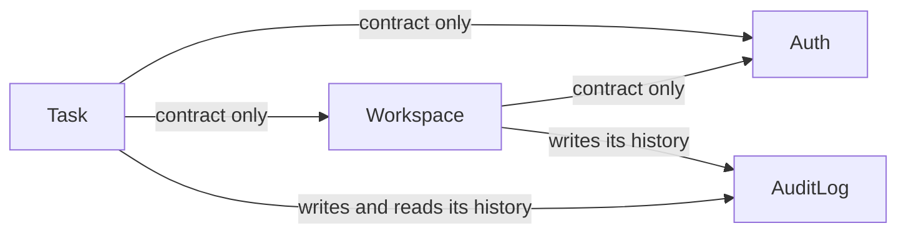
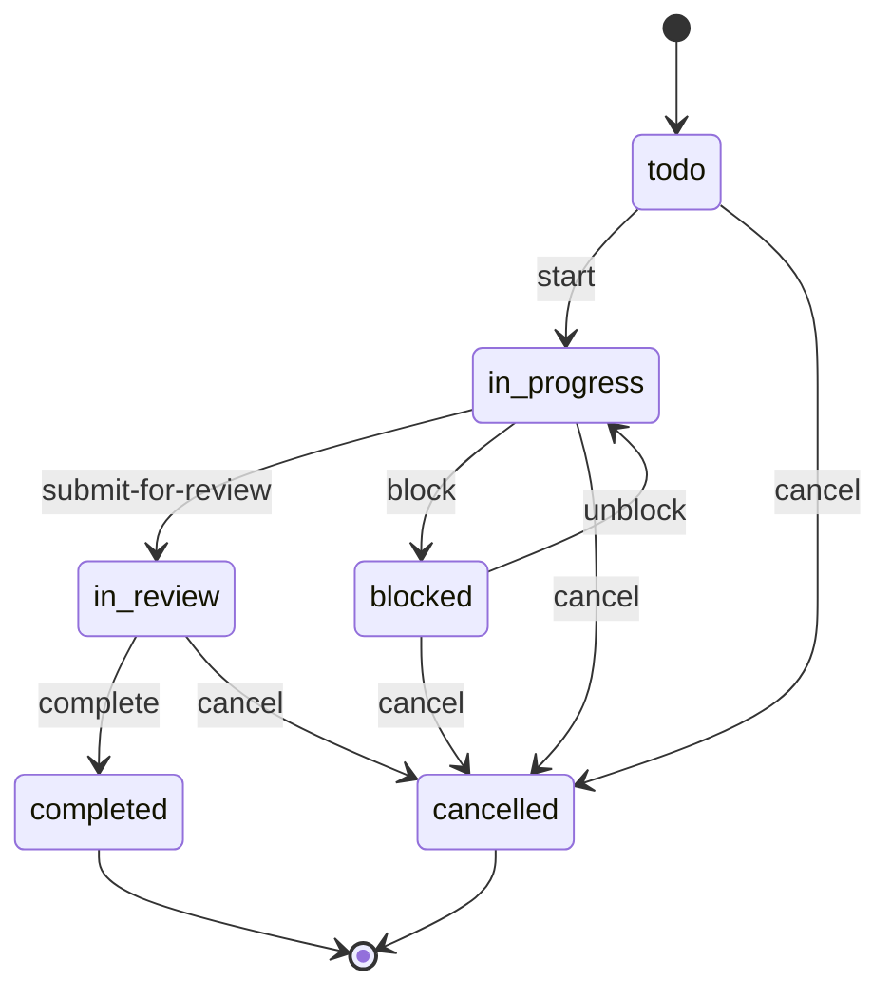

# symfony-todo-app


A task API built as a modular Symfony monolith. The domain is small on purpose: the
project is about the decisions behind it. Each one is written down with the alternatives
that lost and what the choice costs, and the ones that were later revised are kept.

## What the application does

A task tracker for a small team: people share tasks in workspaces, each with a role.

The rules it enforces now:

- **A task belongs to a workspace.** Its members see it, a viewer only reads it, and
  nobody else can read it, change it, or learn that it exists
  ([0020](docs/adr/0020-a-task-belongs-to-a-workspace.md),
  [0011](docs/adr/0011-foreign-task-answers-404.md)).
- **A task is held by someone who can work on it.** It is assigned to an owner or a
  member, never to a viewer, and whoever leaves, is removed or becomes a viewer is taken
  off their unfinished tasks
  ([0021](docs/adr/0021-a-task-has-an-assignee-who-can-work.md)).
- **Work moves one way:** to do → in progress → in review → completed. Finished work stays
  finished — a completed or cancelled task cannot be reopened
  ([0015](docs/adr/0015-task-lifecycle-as-explicit-transitions.md)).
- **Cancelling takes an explanation.** A task cannot be dropped silently; the reason stays
  with it.
- **Stuck work is visible.** A task in progress can be blocked, with a reason, and it does
  not move forward until it is unblocked
  ([0016](docs/adr/0016-blocked-is-a-status-of-work-in-progress.md)).
- **Every change leaves a record:** who changed what, from which value to which, and when
  the status moved. The record is written together with the change, so it cannot be
  missing ([0012](docs/adr/0012-synchronous-audit-log-one-transaction.md)).
- **A task is found by what it says.** Search covers the title and the description and
  puts the best match first ([0013](docs/adr/0013-task-search-postgresql-full-text.md)).
- **A session can be ended.** Logging out on one device ends the sessions on all of them,
  within 15 minutes at most ([0005](docs/adr/0005-revocable-sessions.md)).

- **People work together in workspaces.** A workspace has owners, members and viewers,
  always at least one owner, and every user starts with a personal one
  ([0019](docs/adr/0019-workspaces-members-and-roles.md)).

What comes next ([roadmap](docs/roadmap.md)): each role gets its own rights and everyone
a list of their own tasks; then limits on work in progress and deadlines with
consequences.

## Where to look

| Question | Answer | Record |
|---|---|---|
| How is the code organised? | Modules that own their slice end to end and register themselves | [0001](docs/adr/0001-feature-based-modular-monolith.md) |
| How does a browser stay logged in? | Short access token and rotating refresh token, both in HttpOnly cookies; logout revokes the session | [0004](docs/adr/0004-access-token-in-httponly-cookie.md), [0005](docs/adr/0005-revocable-sessions.md) |
| How does a failure reach the client? | Exceptions mapped to statuses in configuration, rendered by a serializer normalizer — after a first design that did not hold | [0006](docs/adr/0006-errors-rendered-by-exception-subscriber.md) → [0007](docs/adr/0007-exception-mapping-and-error-normalizer.md) |
| How far does the API follow JSON:API? | Responses and query parameters do, request bodies stay plain JSON — full compliance was built on a branch and measured | [0008](docs/adr/0008-json-api-responses-plain-json-requests.md) |
| What is logged? | Per request: buffered quietly, written on failure, tagged with request and user ids | [0009](docs/adr/0009-production-logging.md) |
| What may modules know about each other? | A module's `Contract/` namespace, ids instead of entities, events to break a cycle — checked by Deptrac | [0018](docs/adr/0018-modules-meet-through-contracts.md) |
| Who reaches a task? | The members of its workspace; a viewer only reads; anyone else gets `404`, exactly like for a missing task | [0020](docs/adr/0020-a-task-belongs-to-a-workspace.md), [0011](docs/adr/0011-foreign-task-answers-404.md) |
| Can the audit log disagree with the data? | No: it is written in the same transaction, one flush per use case | [0012](docs/adr/0012-synchronous-audit-log-one-transaction.md) |
| Why a stored `tsvector` column for search? | Because results are ranked — measured against an expression index on a million tasks | [0013](docs/adr/0013-task-search-postgresql-full-text.md) |
| Who decides which status may follow which? | The `Task` entity; Symfony Workflow was built on a branch and compared | [0014](docs/adr/0014-task-status-changed-as-part-of-an-update.md) → [0015](docs/adr/0015-task-lifecycle-as-explicit-transitions.md) |
| Is a blocked task a status or a flag? | A status of work in progress, as most teams use it; Jira's flag and task links were weighed | [0016](docs/adr/0016-blocked-is-a-status-of-work-in-progress.md) |

All records: [docs/adr](docs/adr/README.md). Diagrams of the containers, the modules, the
authentication flow and a task transition: [docs/architecture.md](docs/architecture.md).

## Modules



An arrow reads "depends on". Every module also uses `Shared`, which depends on none. `Auth` — registration, login, refresh, logout. `Task` — tasks, their lifecycle, search and
history. `Workspace` — who works together and in which role. `AuditLog` — who changed what; modules write to it, and it knows none of them
([0017](docs/adr/0017-audit-log-as-its-own-module.md)). `Shared` — technical code every
module uses: error rendering, JSON:API responses.

## Task lifecycle



`completed` and `cancelled` are final: nothing leads out of them, and the circle at the
bottom marks the end of a task's life, not a status. A transition is its own endpoint
(`POST /api/v1/tasks/{id}/start`), a refused one answers `409`, and each one writes the
status history and the audit log in one transaction.

## Deliberately not built

| What | Why not | What would change that |
|---|---|---|
| API Platform | It brings its own architecture — state providers and processors in place of the use-case services, specifications and module boundaries this project is built around ([0008](docs/adr/0008-json-api-responses-plain-json-requests.md)) | Many resources with little behaviour of their own, where CRUD generated from the model is the point |
| An identity provider (Keycloak, Auth0, SSO) | Deferred, not rejected: this stage is about building the mechanism ([0002](docs/adr/0002-authentication-inside-the-application.md)) | SSO, MFA, or third-party applications acting on a user's behalf |
| Full JSON:API compliance | About 450 lines of custom infrastructure around Symfony's standard tools, for a CRUD model the project is moving away from; kept on `feature/api-json-api-compliance` | A client that consumes JSON:API generically, through a JSON:API library |
| Symfony Workflow | Same amount of code, but the entity can no longer protect its own status; kept on `feature/task-lifecycle-workflow` | Several transition rules contributed by different modules |
| A search engine | Two columns of one table; measured on a million tasks, PostgreSQL answers in milliseconds for an ordinary user ([0013](docs/adr/0013-task-search-postgresql-full-text.md)) | Typo tolerance, or ranking that outgrows its ceiling — about 300 ms for 29,000 matches |
| A message bus | Nothing runs asynchronously yet; the audit log is written in the same transaction on purpose ([0012](docs/adr/0012-synchronous-audit-log-one-transaction.md)) | A side effect that is slow or calls another system |
| CQRS, a separate read store, event sourcing | One model serves both sides without strain: lists are specifications over the entity, and the one read that needed tuning, search, was solved with an index and a measurement | A read the entity cannot serve, such as a board with counts per status |
| Microservices | One deployable keeps a change and its audit record in one transaction ([0012](docs/adr/0012-synchronous-audit-log-one-transaction.md)) and needs no network between modules | A module with its own scaling or release cadence |
| `Application/Domain/Infrastructure` layers inside a module | Modules are cut by feature, and each owns its slice end to end ([0001](docs/adr/0001-feature-based-modular-monolith.md)) | — |

## Quality gates

Every pull request that changes code runs, against a real PostgreSQL:

- PHP-CS-Fixer and PHPStan level 8
- Deptrac — the allowed dependencies between modules, declared in `deptrac.php`
- `lint:container` for the development and production containers
- migrations, then `doctrine:schema:validate`
- PHPUnit — application tests through HTTP, unit tests for the domain rules

## Stack

PHP 8.5 · Symfony 8.1 · Doctrine ORM · PostgreSQL 18 · Redis · Docker Compose

## Quick start

```sh
echo "JWT_SECRET=$(openssl rand -hex 32)" >> .env.local
make build
make up
make migrate
```

The OpenAPI description is in [docs/openapi.json](docs/openapi.json); `make generate-openapi`
regenerates it.

## Commands

```sh
make check-code      # code style, static analysis, tests
make run-tests
make run-phpstan
make run-cs
make db-reset        # drop all tables and run the migrations
make                 # the full list
```

## Roadmap

What comes next and what is done: [docs/roadmap.md](docs/roadmap.md).
