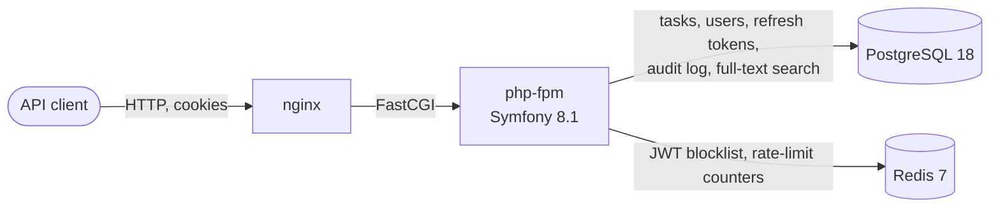
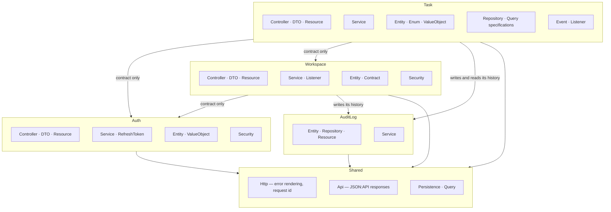
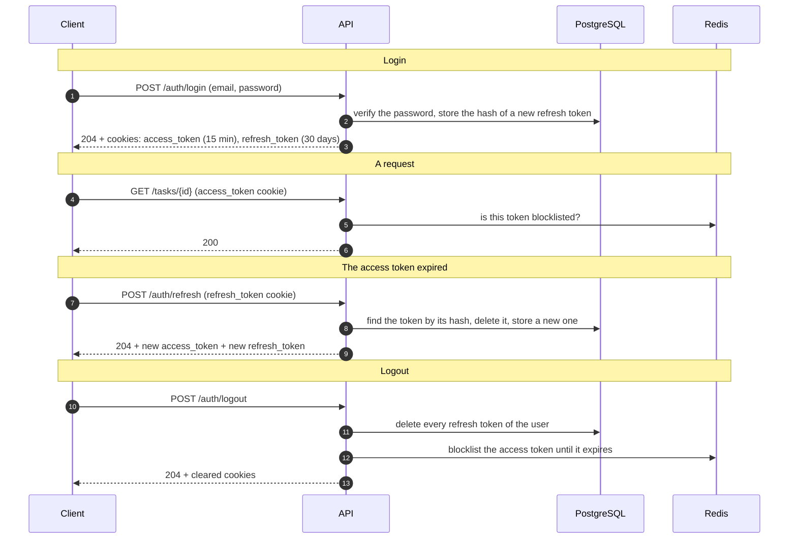
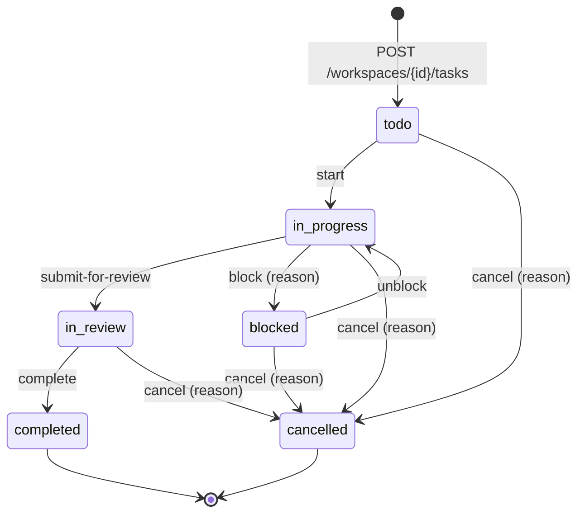
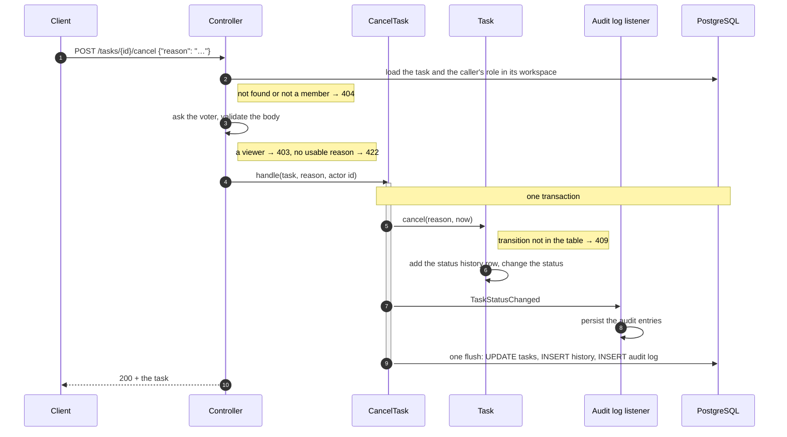

# Architecture

Four views of the application. Each one links the decision record that explains why it
looks this way.

## Containers

One deployable application and one database. PostgreSQL also serves the search
([0013](adr/0013-task-search-postgresql-full-text.md)). Redis holds short-lived data: the
blocklist of logged-out access tokens, read on every authenticated request, and the
rate-limit counters.

## Modules

An arrow reads "depends on". A module owns its slice end to end and registers itself through its own `di.php` and
`routing.php` ([0001](adr/0001-feature-based-modular-monolith.md)). `Shared` depends on no
module, and the audit log on none of the modules that write to it: a record names its
actor by id ([0017](adr/0017-audit-log-as-its-own-module.md)). The allowed
dependencies are declared in `deptrac.php` and checked in CI. `Task` and `Workspace` use
only `Auth`'s contract — an interface for the current user, a lookup by email and the
registration event — and `Task` only `Workspace`'s: a member's role and a reference to
the workspace ([0018](adr/0018-modules-meet-through-contracts.md)).

## Authentication

Both tokens live in HttpOnly cookies ([0004](adr/0004-access-token-in-httponly-cookie.md));
the refresh cookie is sent only to `/api/v1/auth`.
The access token is short-lived and stateless; the refresh token is stored only as a
SHA-256 hash and rotated on every use, which is what makes a session revocable
([0005](adr/0005-revocable-sessions.md)). The auth endpoints sit behind their own firewall,
so a stale access token cannot block a login or a refresh.

## Task lifecycle

`completed` and `cancelled` are final: nothing leads out of them, and the circle at the
bottom marks the end of a task's life, not a status. The table lives in `TaskTransition`, and the `Task` entity enforces it: it has no status
setter, only `start()`, `submitForReview()`, `complete()`, `block()`, `unblock()` and
`cancel()` ([0015](adr/0015-task-lifecycle-as-explicit-transitions.md),
[0016](adr/0016-blocked-is-a-status-of-work-in-progress.md)). A task's response links the
transitions its status allows, so a client knows which actions to offer.

### What one transition does

The order of the first two steps is deliberate: an invalid body sent to a task of a
workspace the caller is not in answers `404`, not a `422` that would confirm the task
exists ([0011](adr/0011-foreign-task-answers-404.md),
[0020](adr/0020-a-task-belongs-to-a-workspace.md)). The audit entries are written in the same
transaction as the change, so the history cannot disagree with the data
([0012](adr/0012-synchronous-audit-log-one-transaction.md)).
